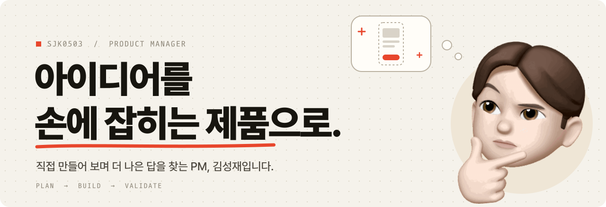
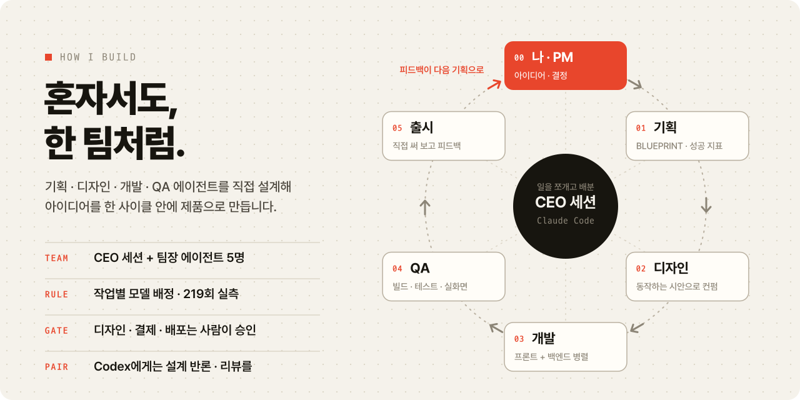
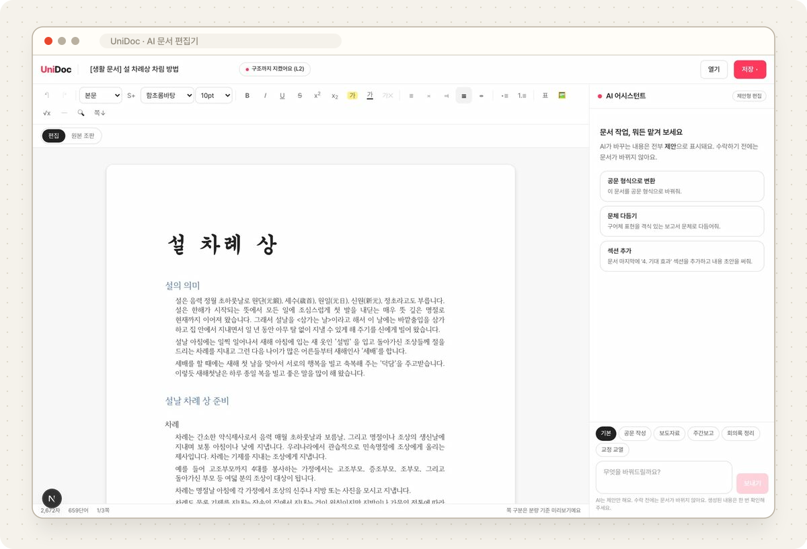
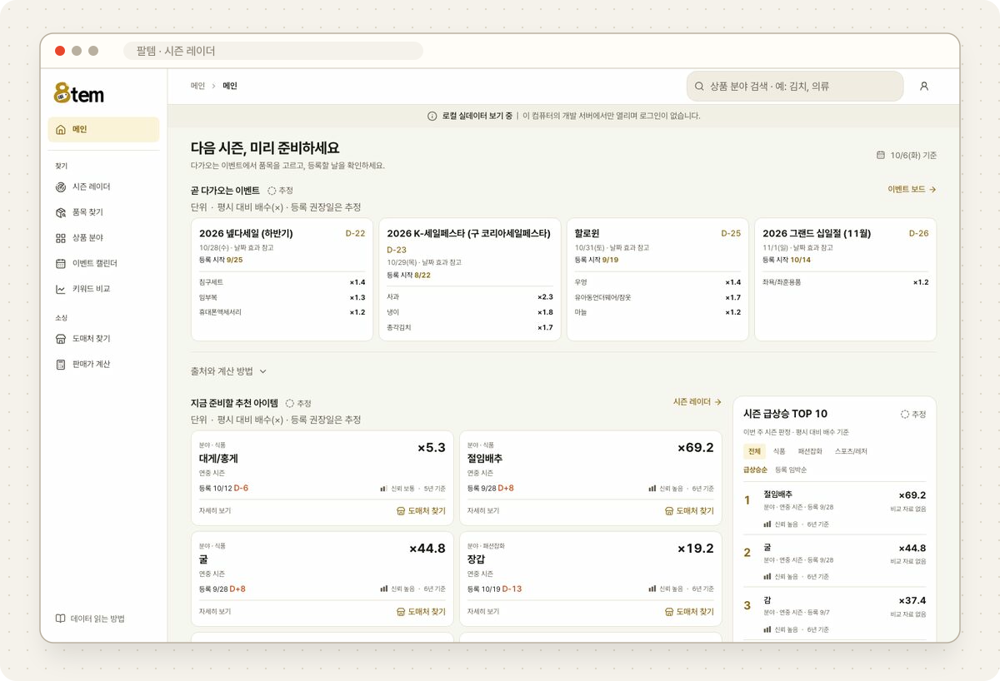
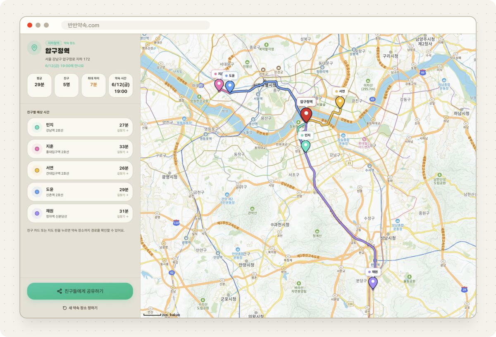
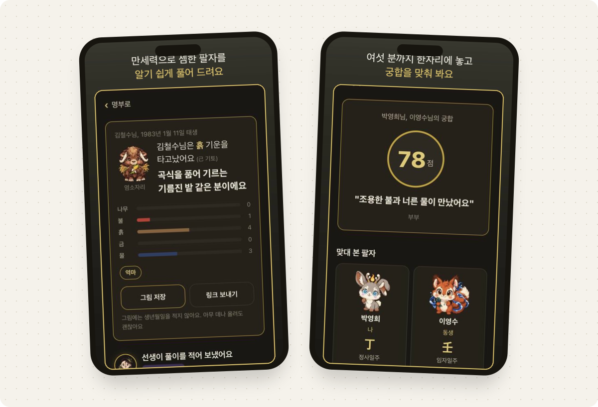

<picture>
  <source media="(prefers-color-scheme: dark)" srcset="./assets/banner-dark.svg">
  
</picture>

 

[📮 ymalk0503@gmail.com](mailto:ymalk0503@gmail.com) &nbsp;·&nbsp; [📒 포트폴리오 (Notion)](https://sjk0503.notion.site/portfolio) &nbsp;·&nbsp; [✍️ 공부 기록 (Blog)](https://jkelly.tistory.com/)

 

## 👋 안녕하세요, 김성재입니다

**직접 만들어 보며 더 나은 답을 찾는 PM**입니다. 기획한 것을 직접 만들어 볼 때 가장 즐겁습니다.

- 컴퓨터공학을 전공하고 **삼성 청년 SW·AI 아카데미**(SSAFY)에서 개발을 배운 뒤, 지금은 기업용 생성형 AI 서비스의 **PM**으로 일하고 있습니다.
- AI 문서 업무 앱을 기획부터 출시·운영까지 맡고, 기업 고객의 보안 요구를 제품 정책으로 정리합니다.
- 퇴근 후에는 **바이브 코딩으로 20개가 넘는 서비스**를 만들며, 기획서 한 줄이 실제로 어떤 문제를 만드는지 먼저 겪어 봅니다.

 

## 🧭 제가 잘하는 것

<table>
<tr>
<td width="33%" valign="top">

### 💡 기획 · 아이디어

일상의 불편에서 출발해 문제를 정의하고, 만들기 전에 **기획서부터** 씁니다.

- 경쟁 제품 기능 감사로 우선순위 정하기
- 성공 지표와 '하지 않을 것'부터 정하기
- 원가와 시장 가격으로 가격 설계하기
- 정책·심사 요건을 기획 단계에서 반영하기

</td>
<td width="33%" valign="top">

### 🤖 바이브 코딩

**Claude Code · Codex**로 기획한 것을 직접 만들어 검증합니다.

- 기획·디자인·개발·QA 에이전트 팀 설계
- 219회 실측으로 작업별 AI 모델 배정
- AI가 직접 검증하는 MCP 도구 제작

</td>
<td width="33%" valign="top">

### 🧑‍💻 개발 이해도

**컴퓨터공학 전공**으로, 개발자와 같은 언어로 이야기합니다.

- 정보처리기사 · PCCP Lv.3 (C++)
- SSAFY 13기 임베디드 로봇 트랙
- 논문 장려상 · 자율 프로젝트 1등

</td>
</tr>
</table>

 

## 🛠️ 일하는 방식

<picture>
  <source media="(prefers-color-scheme: dark)" srcset="./assets/howibuild-dark.svg">
  
</picture>

코드는 AI가 쓰고, 저는 **무엇을 왜 만들지, 어디까지 만들지, 언제 멈출지**를 정합니다. 직접 만들면서 얻은 원칙은 이렇습니다.

- **명세가 자세하면 모델 차이는 작다.** 219회 실측 결과를 작업별 모델 배정 규칙으로 만들어 매일 씁니다.
- **도구는 판단하지 않는다.** 도구가 성공·실패를 대신 판단하면 AI가 사고를 멈춥니다. 도구는 원본 데이터만 돌려주고 판단은 AI에게 맡깁니다.
- **실행은 사람이 승인한 뒤에.** AI 에이전트의 쓰기 작업은 미리보기와 승인 단계를 거치도록 설계합니다.

 

## 🚀 직접 기획하고 만든 것들

<table>
<tr>
<td width="50%" valign="top">
<picture>
  <source media="(prefers-color-scheme: dark)" srcset="./assets/shot-unidoc-dark.svg">
  
</picture>
</td>
<td width="50%" valign="top">

### UniDoc &nbsp;AI 문서 편집기 · 2026.06 – 09

공공은 hwp, 기업은 docx, 유통은 PDF. 한국 문서 환경에서 포맷을 오가는 불편을 줄이려고 기획한 편집기입니다.

- 경쟁 5개 제품 **138개 기능을 감사**해 공공문서 필수 기능 65개를 먼저 목표로 설정
- 문서 모델은 하나, 포맷은 저장할 때 고르는 **'저장 = 변환'** 구조
- AI는 문서를 직접 고치지 않고 **변경 추적으로만 제안**하고, 사용자가 수락·거절
- 실파일 **714 / 714 무손실** 재저장 · docx → hwp **311 / 315** 변환 (손실 4건은 사용자에게 고지)

개인 프로젝트 · 기획 · 설계 · 개발 · 검증

</td>
</tr>
<tr>
<td width="50%" valign="top">

### 팔템 &nbsp;셀러용 시즌 트렌드 대시보드 · 2026.09 – 10

셀러는 시즌 상품을 언제 올리고 언제 내릴지 감으로 정합니다. 명절·기념일 **D-day 기준**으로 트렌드를 정렬해 등록 시점을 보여 줍니다.

- 기존 키워드 도구에 없는 차별점 4가지 정의: D-day 정렬(음력 명절 보정), 등록 권장일 역산, 공공 통계 결합, 산식·출처 공개
- 크롤링 금지, 상대지수를 '판매량'으로 표기하지 않기 같은 **약관·정직성 원칙**을 먼저 확정
- 6일 동안 기획 → 명세 5종 → 구현 → QA를 진행하며 **의사결정 기록 10건**과 리서치 문서 14종을 남기고 초대제로 배포

사이드 프로젝트 · 기획 · AI 에이전트 팀 총괄

</td>
<td width="50%" valign="top">
<picture>
  <source media="(prefers-color-scheme: dark)" srcset="./assets/shot-8tem-dark.svg">
  
</picture>
</td>
</tr>
<tr>
<td width="50%" valign="top">
<picture>
  <source media="(prefers-color-scheme: dark)" srcset="./assets/shot-banban-dark.svg">
  
</picture>
</td>
<td width="50%" valign="top">

### 반반약속 &nbsp;모두에게 공평한 만남 장소 · 2026.05

약속 장소를 정하면 누군가는 늘 멀리 옵니다. 친구들이 **비슷한 이동시간으로 도착하는 장소**를 추천하는 웹앱입니다.

- 평균 이동시간보다 **친구 간 편차**를 핵심 지표로 삼고, 응답 p95 12초 · 공유 전환 30%를 목표로 설정
- 처음 정한 '편차 5분 이하'가 광역 약속에서는 불가능하다는 것을 알고리즘 검토로 확인하고 **케이스별 목표로 수정**
- 회원가입·로그인·DB 없는 **무가입 원칙**. 결과는 링크 하나로 재현되고 카카오톡으로 바로 공유
- 첫 커밋 1주일 만에 라이브 출시, 이후 토스 미니앱 버전까지 제작

🔗 **[반반약속.com](https://xn--eh3ba503bgte.com)** · 라이브 운영 중 · 개인 프로젝트

</td>
</tr>
<tr>
<td width="50%" valign="top">

### 사주 명가 &nbsp;AI 사주 · 궁합 토스 미니앱 · 2026.07 – 08

철학관은 3~10만 원, 앱은 어려운 한자 말투가 장벽입니다. 사주와 별자리를 **쉬운 우리말과 큰 글씨**로 풀어 주는 토스 미니앱입니다.

- 풀이 1건의 AI 원가(약 35원)와 시장 가격을 놓고 **크레딧 가격표와 월 4,950원 구독**을 설계. 첫 자동결제 문턱을 커피 한 잔 아래로
- 중장년 사용자를 위한 **50대 UX 원칙**(큰 글씨, 표마다 쉬운 말 풀이)을 디자인 기준으로 고정
- 생성형 AI 고지 화면, 입력 필터 같은 **플랫폼 정책 요건을 기획 단계에서** 반영
- 풀이 · 궁합(2~6인) · AI 상담 · 구독까지 구현하고, 착수 3주 만에 토스 검수 제출

개인 프로젝트 · 기획 · 가격 · 정책 · 개발

</td>
<td width="50%" valign="top">
<picture>
  <source media="(prefers-color-scheme: dark)" srcset="./assets/shot-sajoo-dark.svg">
  
</picture>
</td>
</tr>
</table>

### 🧩 AI 개발 도구 (공개 저장소)

| 저장소 | 한 줄 소개 |
|---|---|
| [**AI-QA**](https://github.com/sjk0503/AI-QA) | AI 코딩 에이전트에게 '눈'을 붙여 주는 MCP 서버. AI가 브라우저를 직접 열고 클릭하며 검증하고, 사람은 라이브 대시보드로 지켜봅니다. |
| [**vibe-cli**](https://github.com/sjk0503/vibe-cli) | Claude Code 위에 얹는 CLI. CEO 세션이 기획·디자인·프론트·백엔드·QA 팀장 에이전트에게 일을 나눠 한 터미널에서 제품을 만듭니다. |
| [**debaterAI**](https://github.com/sjk0503/debaterAI) | Claude와 Codex가 토론해 합의한 방향으로 에이전트가 코드를 고치는 데스크톱 앱. 체크포인트와 롤백을 지원합니다. |
| [**resume-cli**](https://github.com/sjk0503/resume-cli) | 재부팅 후에도 AI 코딩 세션을 터미널 탭째 복원하는 CLI |
| [**vibe_clean**](https://github.com/sjk0503/vibe_clean) | AI CLI가 남긴 좀비 프로세스와 캐시를 안전하게 정리하는 zsh 함수 |

<b>그 외 만든 것들</b> (펼치기)

 

| 이름 | 내용 | 시기 |
|---|---|---|
| work-os | 메일·슬랙 후속 업무를 AI가 초안까지 준비하고 사람은 승인만 하는 업무 에이전트 (RAG, 출처 표시) | 2026.07 – |
| claude-multimodel | 작업 유형별로 어떤 AI 모델을 쓸지 219회 실측으로 정한 평가 도구 | 2026.09 |
| troy | AI와 기록하고 다른 AI에서 이어 쓰는 작업 기억 (MCP 도구 7종) | 2026.09 |
| 알려봄 | 소상공인이 사진과 짧은 질문으로 홍보 문구를 받는 AI 홍보 코치 (팀 프로젝트) | 2026.08 – 09 |
| fit-log | 어제와 같은 구도로 오늘의 착장을 찍는 카메라 앱 (Flutter) | 2026.02 – 08 |

 

## 🎓 PM 이전: 개발자로 쌓은 기초

| | 프로젝트 | 내용 | 성과 |
|:-:|---|---|---|
| 📸 | **3D Photo Booth** | 2D 네컷사진을 AI 기반 3D 모델로 바꾸는 촬영 키오스크 | 🥇 SSAFY 자율 프로젝트 1등 |
| 💬 | **FINE FRIENDS** | 외부 API로 답변을 교차 검증하는 Tool-Augmented 챗봇, 토큰 약 28% 절감 | 🏅 KCC 2024 학부생 논문 장려상 외 2건 |
| 🌧️ | **침수 예방 시스템** | CCTV AI(YOLOv8 · Fast-SCNN)와 강수 데이터로 침수 위험도를 3단계로 산출 | SSAFY |
| 🏠 | **스마트 IoT 제어 플랫폼** | 생활가전을 자율주행 로봇에 도킹해 원하는 위치로 옮기고 제어 | SSAFY |
| 🤖 | **Smart Factory** | 웹 클릭과 채팅으로 원격 조작하는 로봇팔 (ROS2 · YOLOv5) | SSAFY |
| 🚦 | **[스마트 신호등](https://github.com/sjk0503/raspi_controller)** | 대기 인원에 따라 보행 신호 시간을 조절 (YOLO · Raspberry Pi) | 개인 프로젝트 |

자세한 내용은 [Notion 포트폴리오](https://sjk0503.notion.site/portfolio)에 정리해 두었습니다.

 

## 🏆 수상 · 자격

- 🥇 **2025.11** &nbsp;삼성 청년 SW·AI 아카데미 자율 프로젝트 발표회 **1등** (3D Photo Booth)
- 🏅 **2024.11** &nbsp;SW Innovation Week FairDay 장려상
- 🏅 **2024.08** &nbsp;전국대학 소프트웨어 성과 공유 포럼 혁신상
- 🏅 **2024.07** &nbsp;한국정보과학회 KCC 2024 학부생 논문 장려상
- 📜 **2025.09** &nbsp;정보처리기사 · PCCP Lv.3 (C++)

## 🗂️ 걸어온 길

| 기간 | 내용 |
|---|---|
| **2026.01 – 현재** | Product Manager · 기업용 생성형 AI 서비스 |
| **2025.01 – 2025.12** | 삼성 청년 SW·AI 아카데미(SSAFY) 13기 · 임베디드 로봇 |
| **2019.03 – 2025.02** | 동아대학교 컴퓨터공학과 졸업 · 2023 학과 학생회장 (25명) |

## 🧰 도구

| 영역 | 도구 |
|---|---|
| **Product** | 서비스 기획 · 요구사항 명세 · 운영 정책 · SQL 데이터 분석 |
| **AI** | Claude Code · Codex · MCP · 멀티 에이전트 운영 |
| **Build** | TypeScript · Next.js · Python · C++ · Java/Spring · Flutter |

 

이 프로필도 기획하고, Claude Code와 함께 만들었습니다.

